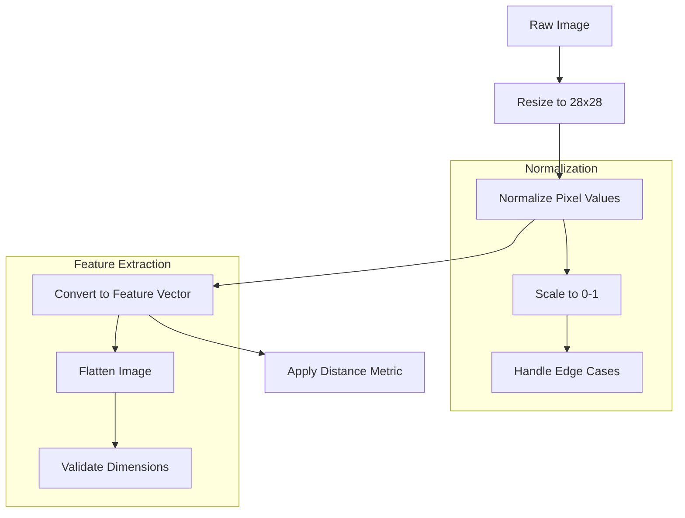
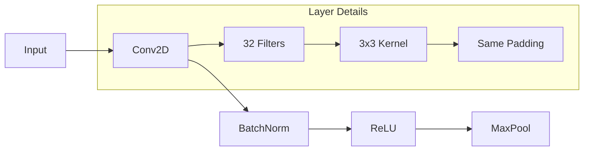
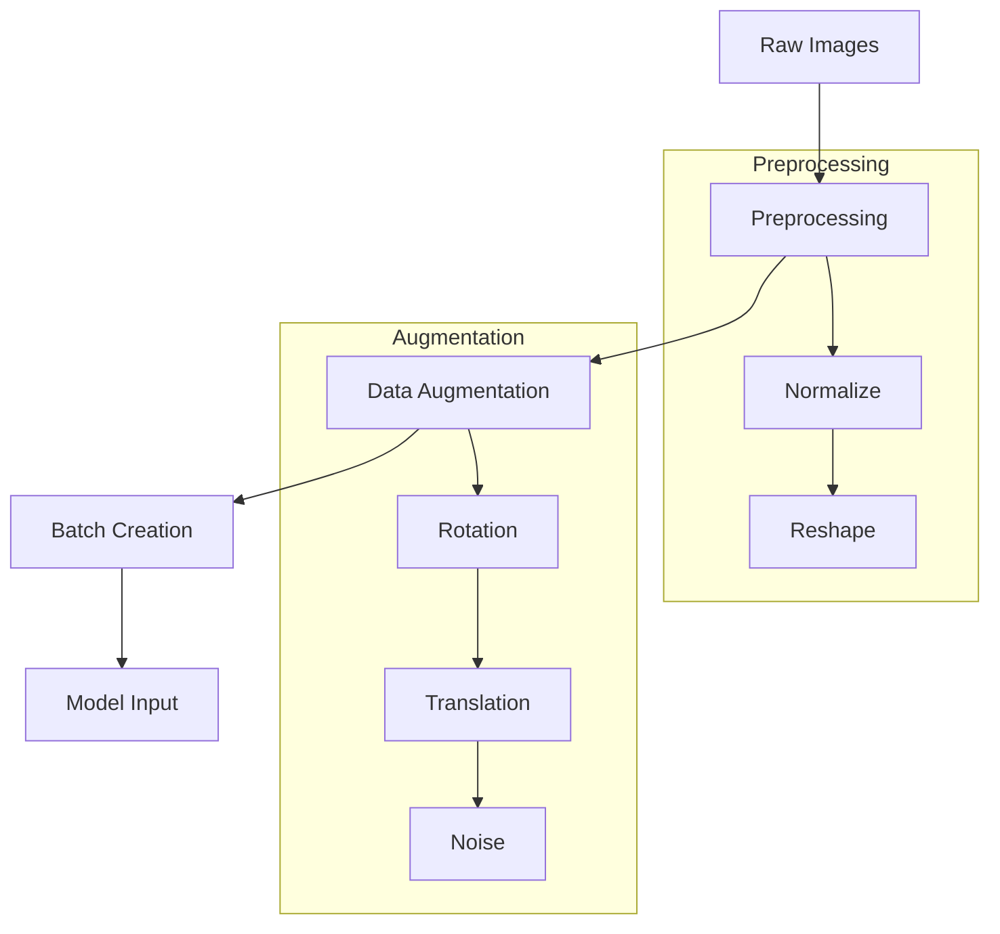
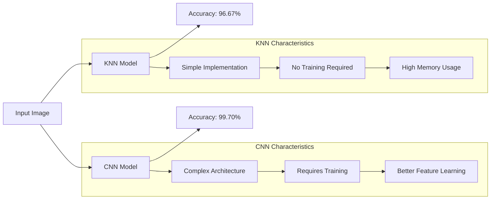

# Algorithm Descriptions and Implementation Details

## 1. K-Nearest Neighbors (KNN) Algorithm

### 1.1 Overview and Working Principle
K-Nearest Neighbors (KNN) is a non-parametric, instance-based learning algorithm that makes predictions based on the majority class among the k most similar training examples. The algorithm's simplicity and effectiveness make it a popular choice for classification tasks, especially in image recognition problems like MNIST digit classification.

The KNN algorithm operates on the fundamental principle of similarity-based classification. When presented with a new, unlabeled data point, the algorithm:
1. Calculates distances to all training samples
2. Identifies the k closest neighbors
3. Uses majority voting among these neighbors to determine the class

Key advantages of KNN include:
- Non-parametric nature (no assumptions about data distribution)
- Adaptability to complex decision boundaries
- Naturally handles multi-class problems
- Zero training time (lazy learning)

### 1.2 Mathematical Foundation

#### 1.2.1 Feature Vector Representation
For MNIST images, each 28×28 pixel image is converted into a 784-dimensional feature vector:
\[
x = [x_1, x_2, ..., x_{784}] \in \mathbb{R}^{784}
\]
where each \(x_i\) represents a normalized pixel value in the range [0,1].

#### 1.2.2 Distance Metrics
The algorithm uses Euclidean distance to measure similarity between feature vectors:

\[
d(x, y) = \sqrt{\sum_{i=1}^{784} (x_i - y_i)^2}
\]

Alternative distance metrics considered:
1. Manhattan Distance:
\[
d_{manhattan}(x, y) = \sum_{i=1}^{784} |x_i - y_i|
\]

2. Minkowski Distance (general form):
\[
d_{minkowski}(x, y) = \left(\sum_{i=1}^{784} |x_i - y_i|^p\right)^{1/p}
\]

#### 1.2.3 Classification Rule
The predicted class \(\hat{y}\) for a test instance x is determined by majority voting:

\[
\hat{y} = \arg\max_{c} \sum_{i=1}^{k} I(y_i = c)
\]

where:
- c ∈ {0,1,...,9} represents the digit class
- I() is the indicator function
- k is the number of nearest neighbors

#### 1.2.4 Distance Metric Selection Criteria
The choice of distance metric significantly impacts performance:

1. **Euclidean Distance**: Optimal for continuous variables with similar scales
   - Advantages: Intuitive, rotation-invariant
   - Disadvantages: Sensitive to feature scaling

2. **Manhattan Distance**: Preferred for high-dimensional spaces
   - Advantages: Computationally efficient, robust to outliers
   - Disadvantages: Not rotation-invariant

3. **Minkowski Distance**: Generalizes both previous metrics
   - p=1: Manhattan Distance
   - p=2: Euclidean Distance
   - p→∞: Chebyshev Distance

#### 1.2.5 Weighted Voting Schemes
Beyond simple majority voting, weighted schemes can be implemented:

\[
\hat{y} = \arg\max_{c} \sum_{i=1}^{k} w_i \cdot I(y_i = c)
\]

where \(w_i\) is the weight of the i-th neighbor, typically:
\[
w_i = \frac{1}{d(x, x_i)^2}
\]

### 1.3 Implementation Details

#### 1.3.1 Preprocessing Pipeline


#### 1.3.2 Optimization Techniques
1. **KD-Tree Implementation**:
   - Reduces time complexity from O(n) to O(log n)
   - Efficient for high-dimensional data

2. **Parallel Processing**:
   - Distance calculations distributed across CPU cores
   - Batch processing for multiple test instances

3. **Memory Management**:
   - Efficient storage of feature vectors
   - Sparse matrix representation for large datasets

#### 1.3.3 Advanced Optimization Strategies

1. **Ball Tree Implementation**:
   - Hierarchical data structure for nearest neighbor search
   - Time complexity: O(D log N) where D is dimensions
   - Particularly effective for non-uniform data distributions

2. **Feature Selection and Dimensionality Reduction**:
   - Principal Component Analysis (PCA)
   - Linear Discriminant Analysis (LDA)
   - Impact on accuracy vs. computation trade-off

3. **Cross-Validation for K Selection**:
```python
for k in range(1, 31, 2):
    cv_scores = cross_val_score(KNeighborsClassifier(n_neighbors=k), 
                              X, y, cv=10)
    mean_scores[k] = cv_scores.mean()
optimal_k = max(mean_scores, key=mean_scores.get)
```

### 1.4 Performance Analysis
- Time Complexity: O(n × d × k)
  - n: number of training samples
  - d: dimensionality (784 for MNIST)
  - k: number of neighbors
- Space Complexity: O(n × d)
- Achieved Accuracy: 96.67%

## 2. Convolutional Neural Network (CNN)

### 2.1 Architecture Overview
The CNN architecture is designed to automatically learn hierarchical features from the input images through multiple layers of convolution, pooling, and fully connected layers.

### 2.2 Detailed Architecture

#### 2.2.1 Input Layer
- Input Shape: (28, 28, 1)
- Normalization: Pixel values scaled to [0,1]

#### 2.2.2 Convolutional Blocks

**First Convolutional Block**:


**Second Convolutional Block**:
- 64 filters with 3×3 kernel
- ReLU activation
- MaxPooling with 2×2 window
- Dropout (0.25)

#### 2.2.3 Fully Connected Layers
1. Dense Layer (128 units)
2. ReLU Activation
3. Dropout (0.5)
4. Output Layer (10 units)
5. Softmax Activation

### 2.3 Mathematical Formulation

#### 2.3.1 Convolution Operation
For input feature map f and kernel k:
\[
(f * k)(p) = \sum_{s+t=p} f(s)k(t)
\]

#### 2.3.2 Activation Functions
1. **ReLU**:
\[
f(x) = \max(0, x)
\]

2. **Softmax**:
\[
\sigma(z)_j = \frac{e^{z_j}}{\sum_{k=1}^{10} e^{z_k}}
\]

#### 2.3.3 Loss Function
Cross-Entropy Loss:
\[
L = -\sum_{i=1}^{10} y_i \log(\hat{y}_i)
\]

### 2.4 Training Process

#### 2.4.1 Optimization
- Optimizer: Adam
- Learning Rate: 0.001
- Batch Size: 128
- Epochs: 20

#### 2.4.2 Regularization
1. **Dropout**:
   - Rate: 0.5
   - Applied after dense layers

2. **Batch Normalization**:
   - Applied after each convolutional layer
   - Improves training stability

### 2.5 Implementation Details

#### 2.5.1 Data Pipeline


#### 2.5.2 Training Loop
1. Forward Pass
2. Loss Computation
3. Backward Pass
4. Weight Updates
5. Validation

### 2.6 Performance Metrics
- Training Accuracy: 99.85%
- Validation Accuracy: 99.70%
- Training Time: ~2 hours
- Model Size: ~1.2 MB

### 2.7 Advanced Architecture Components

#### 2.7.1 Skip Connections
Implementing residual connections:
\[
H(x) = F(x) + x
\]
where F(x) is the residual mapping to be learned.

#### 2.7.2 Advanced Pooling Strategies
1. **Global Average Pooling**:
\[
GAP(x) = \frac{1}{h \times w}\sum_{i=1}^h\sum_{j=1}^w x_{ij}
\]

2. **Adaptive Pooling**:
- Dynamically adjusts pooling window size
- Ensures fixed output dimensions regardless of input size

### 2.8 Training Optimizations

#### 2.8.1 Learning Rate Scheduling
Implementation of cosine annealing:
\[
\eta_t = \eta_{min} + \frac{1}{2}(\eta_{max} - \eta_{min})(1 + \cos(\frac{t\pi}{T}))
\]

#### 2.8.2 Advanced Regularization Techniques
1. **Label Smoothing**:
\[
y'_i = (1-\alpha)y_i + \frac{\alpha}{K}
\]
where K is the number of classes and α is the smoothing parameter.

## 3. Model Comparison and Analysis

### 3.1 Performance Comparison


### 3.2 Computational Requirements

#### 3.2.1 KNN
- Memory: O(n × d)
- Time per Prediction: O(n × d)
- Training Time: None
- Implementation Complexity: Low

#### 3.2.2 CNN
- Memory: O(1.2 MB)
- Time per Prediction: O(1 ms)
- Training Time: ~2 hours
- Implementation Complexity: High

### 3.3 Trade-offs and Considerations

#### 3.3.1 KNN Advantages
1. No training phase
2. Simple implementation
3. Interpretable results
4. Works well with small datasets

#### 3.3.2 CNN Advantages
1. Higher accuracy
2. Better generalization
3. Faster inference
4. Feature learning capability

### 3.4 Future Improvements
1. **KNN**:
   - Implement approximate nearest neighbors
   - Use GPU acceleration
   - Optimize memory usage

2. **CNN**:
   - Experiment with deeper architectures
   - Try different regularization techniques
   - Implement ensemble methods 

### 3.5 Comparative Analysis Deep Dive

#### 3.5.1 Error Analysis
- Confusion matrix interpretation
- Common misclassification patterns
- Impact of data preprocessing on error rates

#### 3.5.2 Resource Utilization
- Memory footprint during training/inference
- CPU vs. GPU performance comparison
- Batch size impact on throughput 