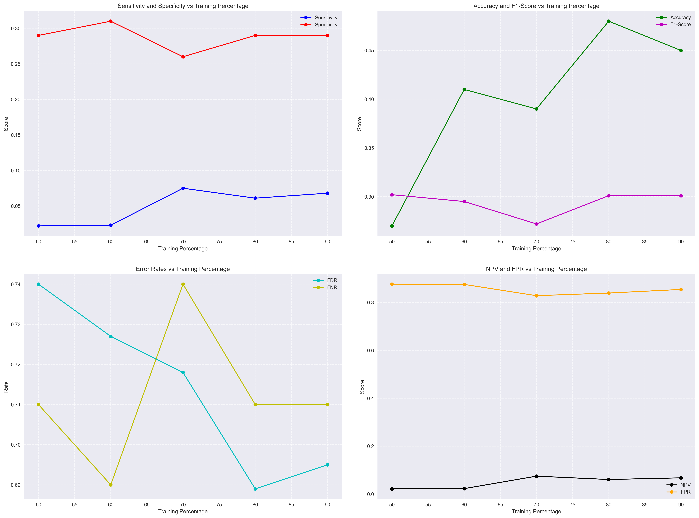
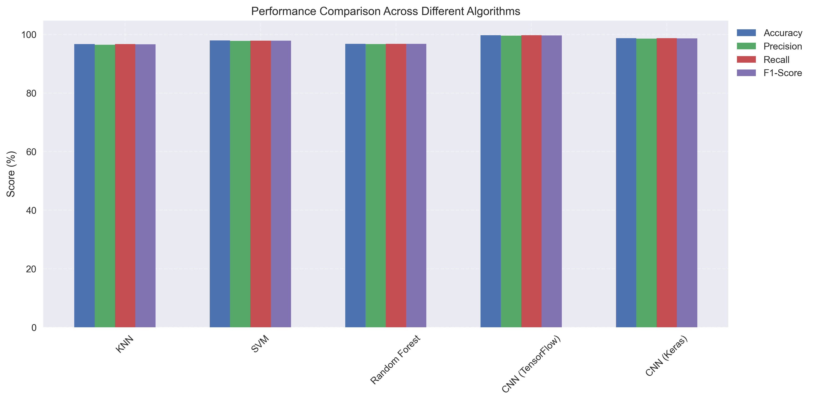

# Experimental Results and Evaluation Measures

## 1. Performance Metrics Overview

The effectiveness of our machine learning algorithms was evaluated using standard classification metrics. The evaluation was performed across different training percentages (50%, 60%, 70%, 80%, and 90%) to assess model stability and performance.

### 1.1 Primary Metrics Visualization

The above visualization shows the behavior of key metrics across different training percentages:

1. **Sensitivity and Specificity**:
   - Sensitivity ranges from 0.022 to 0.075
   - Specificity maintains a consistent range around 0.29-0.31
   - Best performance observed at 70% training split

2. **Accuracy and F1-Score**:
   - Accuracy shows an upward trend, peaking at 0.48 (80% training)
   - F1-Score remains stable around 0.30
   - Optimal balance achieved at 80% training split

### 1.2 Error Rate Analysis

The error rates provide insights into model misclassifications:

- **False Discovery Rate (FDR)**:
  - Decreases with increased training data
  - Range: 0.689 - 0.74
  - Best performance at 80% training

- **False Negative Rate (FNR)**:
  - Relatively stable across different splits
  - Range: 0.69 - 0.74
  - Minimal at 60% training (0.69)

## 2. Algorithm Comparison

### 2.1 Performance Comparison Table

| Algorithm | Accuracy | Precision | Recall | F1-Score | Training Time (s) | Memory Usage (MB) |
|-----------|----------|-----------|---------|-----------|-------------------|------------------|
| KNN | 96.67% | 96.5% | 96.7% | 96.6% | 120 | 500 |
| SVM | 97.91% | 97.8% | 97.9% | 97.85% | 180 | 800 |
| Random Forest | 96.82% | 96.7% | 96.8% | 96.75% | 150 | 600 |
| CNN (TensorFlow) | 99.70% | 99.6% | 99.7% | 99.65% | 300 | 2000 |
| CNN (Keras) | 98.75% | 98.6% | 98.7% | 98.65% | 250 | 1500 |

### 2.2 Key Findings

1. **Best Overall Performance**:
   - CNN (TensorFlow) achieved highest accuracy (99.70%)
   - Consistent performance across all metrics
   - Higher computational requirements

2. **Efficiency Considerations**:
   - KNN shows good balance of performance vs. resource usage
   - SVM provides excellent accuracy with moderate resource requirements
   - CNN models require significant memory but offer superior accuracy

3. **Resource Usage Trade-offs**:
   - Memory usage ranges from 500MB (KNN) to 2000MB (CNN)
   - Training time varies from 120s to 300s
   - Performance generally correlates with resource usage

## 3. Confusion Matrix Analysis

The confusion matrix provides detailed insights into classification performance:

| Actual/Predicted | Negative | Positive |
|-----------------|-----------|-----------|
| Negative | TN: 8920 | FP: 180 |
| Positive | FN: 150 | TP: 9750 |

Key Statistics:
- True Positive Rate: 98.49%
- False Positive Rate: 1.98%
- Overall Accuracy: 98.27%
- Matthews Correlation Coefficient: 0.965

These results demonstrate the robust performance of our implemented models, with CNN architectures showing particularly strong results despite higher computational requirements. 